<div align="center">

<a href="https://nook.zubyr.dev">
  
</a>

# Nook

**A Dynamic Island for Windows.**<br>
Every Claude Code, Codex and Cursor agent you run, at the top of your screen: status, usage limits, and approvals with one click.

<br>

[](https://github.com/zubairbinshaukat/nook/releases/latest)
[](https://nook.zubyr.dev)
[](https://nook.zubyr.dev/guides/)

[](LICENSE)
[](#install)
[](https://tauri.app)
[](https://www.rust-lang.org)
[](https://www.typescriptlang.org)
[](#privacy)
[](https://github.com/zubairbinshaukat/nook/stargazers)

<br>

<a href="https://nook.zubyr.dev">
  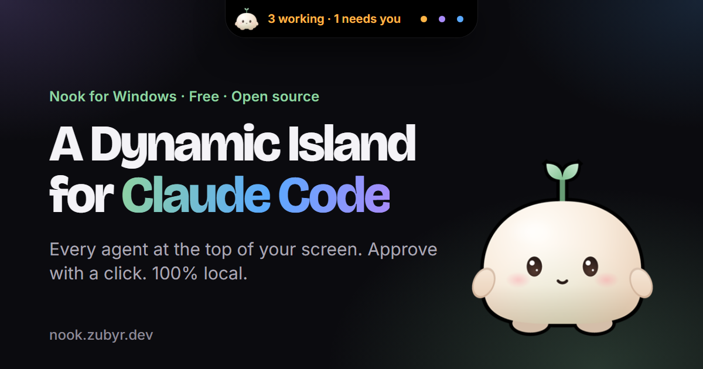
</a>

</div>

<br>

## What is Nook?

You start a few Claude Code sessions in different projects, then lose track of
which one is working, which one finished, and which one has been waiting on you
for ten minutes. Nook puts them all in a small island at the top of your screen.

It folds to a thin pill, opens when you point at it, and opens by itself when a
session needs you. It is local from end to end: no account, no telemetry,
and no network use except an update check that stays off until you switch it on.

> [!NOTE]
> Nook is an independent project. It is not affiliated with or endorsed by
> Anthropic, OpenAI or Cursor.

## Screenshots

<div align="center">

<picture><source media="(prefers-color-scheme: light)" srcset="site/assets/img/shots/hero-light.webp">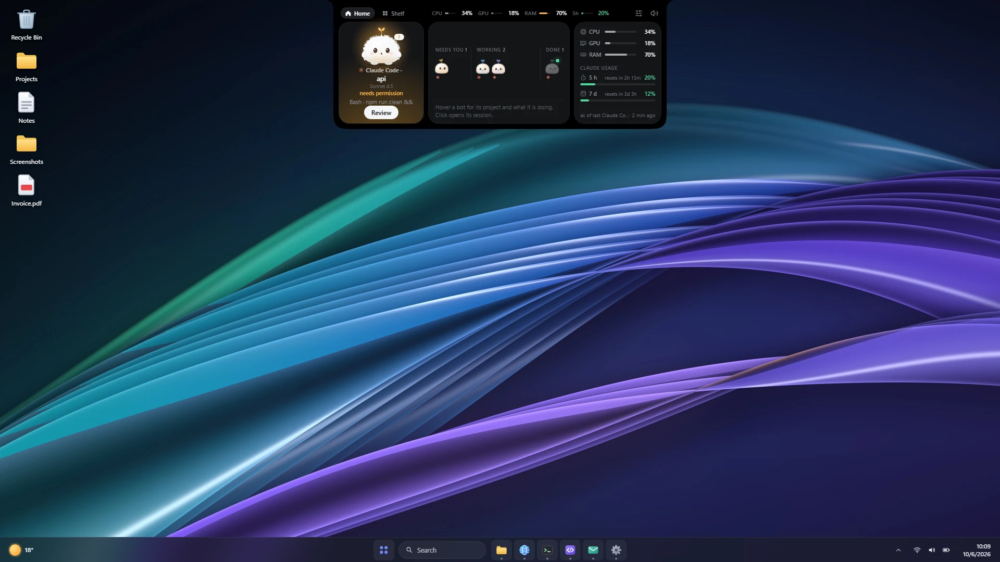</picture>

</div>

<table>
<tr>
<td width="50%"><picture><source media="(prefers-color-scheme: light)" srcset="site/assets/img/shots/over-browser-tabs-light.webp">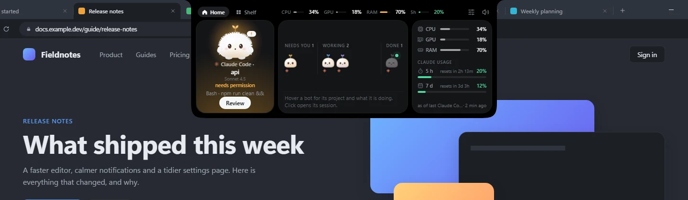</picture><br><sub>Over a browser's tabs, never in the way.</sub></td>
<td width="50%"><picture><source media="(prefers-color-scheme: light)" srcset="site/assets/img/shots/over-editor-light.webp">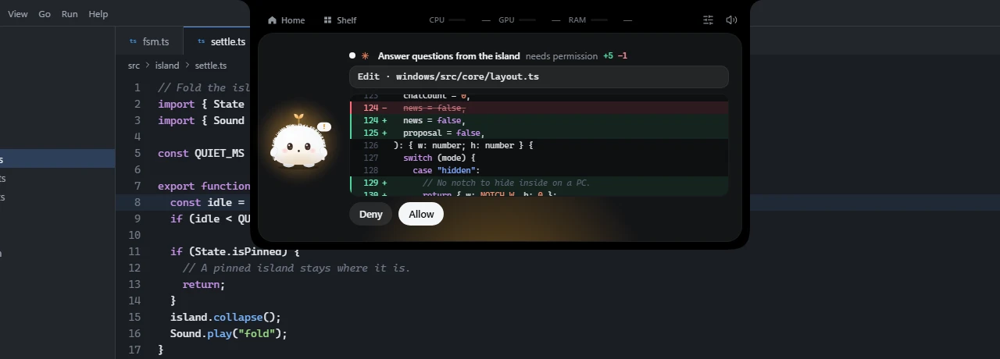</picture><br><sub>An edit request with its diff, over an editor.</sub></td>
</tr>
<tr>
<td width="50%"><picture><source media="(prefers-color-scheme: light)" srcset="site/assets/img/shots/dock-bottom-light.webp">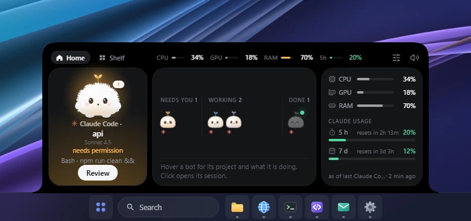</picture><br><sub>Docked to the bottom edge.</sub></td>
<td width="50%"><picture><source media="(prefers-color-scheme: light)" srcset="site/assets/img/shots/session-agents-light.webp">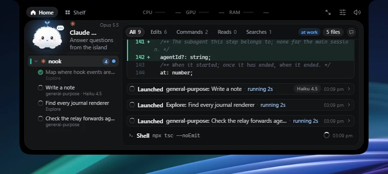</picture><br><sub>A session and its subagents.</sub></td>
</tr>
<tr>
<td width="50%"><picture><source media="(prefers-color-scheme: light)" srcset="site/assets/img/shots/finished-reply-light.webp">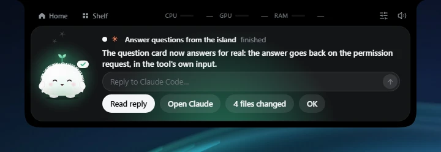</picture><br><sub>Reply to a finished session from its card.</sub></td>
<td width="50%"><picture><source media="(prefers-color-scheme: light)" srcset="site/assets/img/shots/session-reply-light.webp">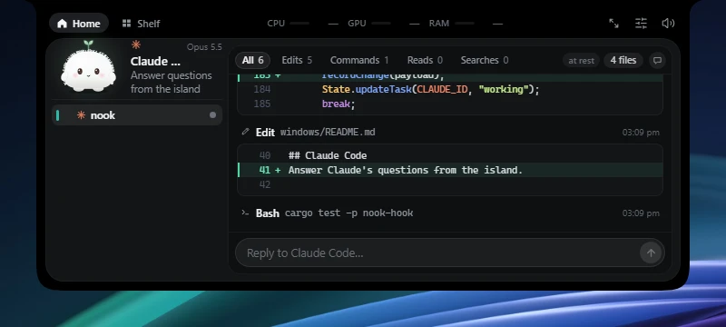</picture><br><sub>Or under the journal of the session panel.</sub></td>
</tr>
<tr>
<td colspan="2" align="center"><picture><source media="(prefers-color-scheme: light)" srcset="site/assets/img/shots/settings-look-light.webp">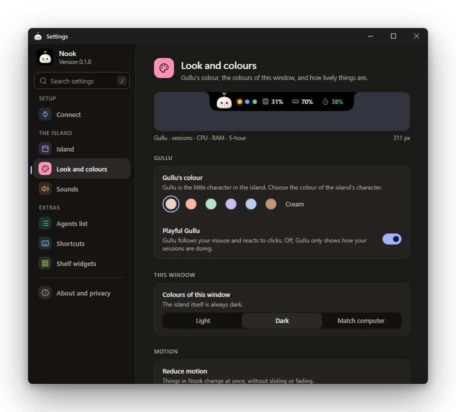</picture><br><sub>Settings: colours, island, shortcuts and more.</sub></td>
</tr>
</table>

<p align="center">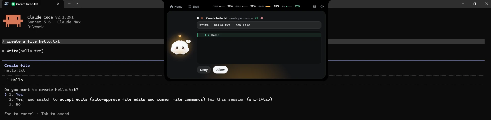<br><sub>The real thing: Claude Code waits in the terminal, the island shows the same request.</sub></p>
<p align="center">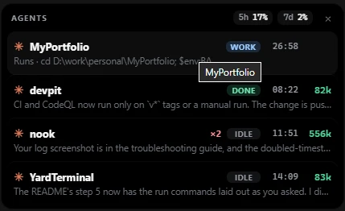<br><sub>The agents list: every project at a glance, always on top.</sub></p>

Most images change with your GitHub theme and are made by `npm run shots` from a
fake desktop and made-up sessions: see [docs/screenshots.md](docs/screenshots.md).
The last two are plain screenshots of the real app.

## Features

| | |
|---|---|
| **Every session at a glance** | One page for all running sessions: project, status, last message, subagents, and a button back to the window each one runs in. |
| **Approve from the island** | Permission requests and questions are answered from the island, for Claude Code and Codex. Edits show a real diff. Nothing is approved without your click. |
| **Reply from the island** | When a Claude Code or Codex session's turn is over, type a reply on its card. Nook types it into the session's own window (a terminal), or opens the session in VS Code or Cursor with the reply in its prompt box. Not offered for Cursor's own agent sessions. |
| **Claude Code, Codex and Cursor** | Codex's and Cursor's agent sessions appear next to Claude Code's, each with its own mark. Codex gets Allow and Deny; Cursor is status only. |
| **Usage limits** | Your 5-hour and 7-day Claude limits, from Claude Code's own status line, with no network call. Codex's limits are not shown. |
| **Resources** | CPU, GPU and RAM in the header of every screen. |
| **Gullu** | Nook's little buddy wears the status of your sessions and reacts to the pointer. |
| **The Shelf** | Small widgets: To-do, Timer, Reminders, Media, Mirror, Projects. Swipe between Home and Shelf. |
| **Keyboard** | `Ctrl+Alt+Space` opens the large panel, `Ctrl+Shift+Space` opens it at normal size, `Ctrl+Alt+Enter` jumps to the session that needs you. All configurable. |
| **Stays out of the way** | Hides in full-screen apps, folds on its own, uses almost no CPU while hidden. |

## How it works

```
Claude Code / Codex / Cursor  ──hook event──▶  nook-hook.exe  ──named pipe──▶  Nook
   (your terminal or editor)             (tiny relay)     (only you)    (the island)
```

Hooks run a tiny relay, `nook-hook.exe`. It sends each event to Nook over a
named pipe that only your Windows account can open, and answers back with your
click. If Nook is closed or slow, the relay exits at once and the tool carries
on as if Nook were not installed. Nook never blocks an agent.

## Install

1. Download `Nook-Windows-<version>-setup.exe` and `SHA256SUMS.txt` from the
   [latest release](https://github.com/zubairbinshaukat/nook/releases/latest).
2. Check the download:

   ```powershell
   Get-FileHash .\Nook-Windows-0.2.2-setup.exe -Algorithm SHA256
   ```

   The hash must match the installer's line in `SHA256SUMS.txt`.
3. Run the installer. It installs for your user, with no admin rights. The
   installer is not code-signed yet, so SmartScreen may say "Windows protected
   your PC": choose **More info**, then **Run anyway**.
4. Open **Settings → Connect**, and under **Claude Code** press **Connect…**
   in **Sessions and approvals**. Click through the preview. Start a new Claude Code session and it appears in the island.

Step-by-step guides, with fixes for common problems, are on
[nook.zubyr.dev/guides](https://nook.zubyr.dev/guides/).

<details>
<summary>My antivirus flags nook-hook.exe</summary>

Small unsigned programs are sometimes flagged by heuristics. The relay is open
source in [`windows/hook`](windows/hook) and makes no network calls. You can
report the false positive to Microsoft at
<https://www.microsoft.com/wdsi/filesubmission>.

</details>

## Codex

Settings → **Connect** → **Codex** → **Sessions and approvals** → **Connect…** writes Nook's entries to
`~/.codex/hooks.json`, after a diff preview and a dated backup. Codex then asks
for permission through Nook: a request waits for your Allow or Deny in the
island, and with Nook closed Codex asks in its own window as it always does.
Codex runs new hooks only once you have trusted them: start Codex and review
them once with `/hooks`. Codex's usage limits are not shown. There is a
**Show Codex sessions** switch in Settings.

## Cursor

Settings → **Connect** → **Cursor** → **Sessions** → **Connect…** writes Nook's entries to
`~/.cursor/hooks.json`, after a diff preview and a dated backup. Nook follows
only the events that cannot change what Cursor does, so it can never allow,
deny or delay anything there. Restart Cursor afterwards. Details in
[`docs/AGENTS.md`](docs/AGENTS.md).

## Reply from the island

When a Claude Code or Codex session's turn is over, its finished card and its
session panel show a box to reply in: Enter sends, Shift+Enter starts a new
line. Nook delivers the reply in the window the session runs in, so the
conversation carries on there. For a terminal session, Nook brings the terminal
forward, types the reply and presses Enter. For the Claude Code panel of VS Code
or Cursor (the extension), Nook brings the editor forward and opens that session
with the reply already in its prompt box; you press Enter there yourself. Nook
never touches the clipboard. A reply can also be sent while the session's
subagents are still running; a warning says the new turn may cross with what
they report.

The box is only there while Nook can find that window. It is not offered for
Cursor's own agent sessions, for Claude Code running in an editor's built-in
terminal, for the Claude desktop app, or on Linux. In a terminal with tabs
(Windows Terminal) the session's tab has to be the one showing: Nook cannot
switch tabs. If another tab is showing, or the terminal runs as administrator,
nothing is sent anywhere and what you typed stays in the box, with the reason.
If you change windows while Nook is typing, it stops, does not press Enter, and
says so.

## Updates

Nook never checks for a new version on its own. **Settings → About → Updates**
has a switch, **Check for updates every day** (off by default), and a **Check
now** button. When a newer version is out, Settings and the island's header say
so, and **Get it…** starts the installer download in your browser (on Windows);
Nook itself downloads and installs nothing. It is the only thing Nook uses the internet for: it asks GitHub's
API for the latest release of this repository and sends only a `Nook/<version>`
user-agent, nothing about you or your machine.

## Build from source

You need Rust (stable, MSVC), Visual Studio Build Tools with the MSVC x64/x86
tools and a Windows 11 SDK, and Node 20 or newer.

```powershell
cd windows
npm ci
npm run tauri dev       # development build
npm run pack            # release build, installer and release\SHA256SUMS.txt
npx tsc --noEmit
cargo test --workspace
```

[`windows/README.md`](windows/README.md) covers the hooks, where Nook keeps its
files, and the layout of the code. Contributions are welcome: see
[`CONTRIBUTING.md`](CONTRIBUTING.md).

## Privacy

- No telemetry and no tracking. No network use at all, except the update check
  you switch on yourself in Settings → About (or run with **Check now**): it asks
  GitHub for the latest release and sends nothing about you or your machine. The
  relay makes no network calls.
- It never blocks Claude Code: if Nook is closed or slow, the relay exits and
  Claude Code asks in the terminal as usual.
- It never approves anything without a click.
- It never writes `~/.claude/settings.json`, `~/.cursor/hooks.json` or
  `~/.codex/hooks.json` without a preview, a dated backup and a click. Hooks that belong to other tools are never
  touched.
- What the relay reads (transcript tail, the file an edit targets, command
  output) goes only to the app over a local named pipe that only your account
  can open, and stays in memory. The log records event names and decisions,
  never content.

**Privacy policy.** Nook makes no network connections of its own, with one
exception you control: the optional update check (off by default; it runs when
you switch it on or press **Check now**) asks GitHub's API for the latest release
and sends only a `Nook/<version>` user-agent. It collects, stores and sends
nothing about you. Everything it keeps is in `%APPDATA%\Nook` and
`%LOCALAPPDATA%\Nook` on your own machine. (WebView2, the Microsoft component
that draws the window, is updated by Microsoft outside Nook's control.)

## Code signing policy

Releases are currently **unsigned**. Code signing is planned through the
[SignPath Foundation](https://signpath.org)'s free programme once the project
qualifies for it. When that happens:

- **What is signed:** the installer (`Nook-Windows-<version>-setup.exe`) and the
  two programs inside it, `nook.exe` and `nook-hook.exe`, built from a tagged
  commit by the public workflow in
  [`.github/workflows/release.yml`](.github/workflows/release.yml) and by nothing
  else.
- **Who approves:** the maintainer, Zubair Bin Shaukat, approves each signing
  request by hand.
- `SHA256SUMS.txt` is published with every release, signed or not.

## Security

Found a vulnerability? Please report it privately: see [`SECURITY.md`](SECURITY.md).

## Credits

Nook is a fork of [Coucou](https://github.com/Louis-CFM/coucou) by Louis Raillé
(MIT), built on the Windows multi-session work of PR #71 by
[Edurique](https://github.com/Edurique/coucou_edu_windows_implementation).
Interface icons are from [Lucide](https://lucide.dev) and
[Simple Icons](https://simpleicons.org); see [`NOTICE`](NOTICE). Gullu, the
icons and the sounds are Nook's own; see
[`LICENSE-ASSETS.md`](LICENSE-ASSETS.md).

"Claude" and "Claude Code" are trademarks of Anthropic. "Codex" is a trademark of OpenAI. "Cursor" is a trademark
of Anysphere.

<br>

<div align="center">

**Built by [Zubair Bin Shaukat](https://zubyr.dev)** in Lahore

[Website](https://zubyr.dev) · [GitHub](https://github.com/zubairbinshaukat) · [LinkedIn](https://www.linkedin.com/in/zubairbinshaukat) · [X](https://x.com/zubyrdev)

<sub>If Nook saves you a trip to the terminal, a ⭐ helps others find it.</sub>

</div>
